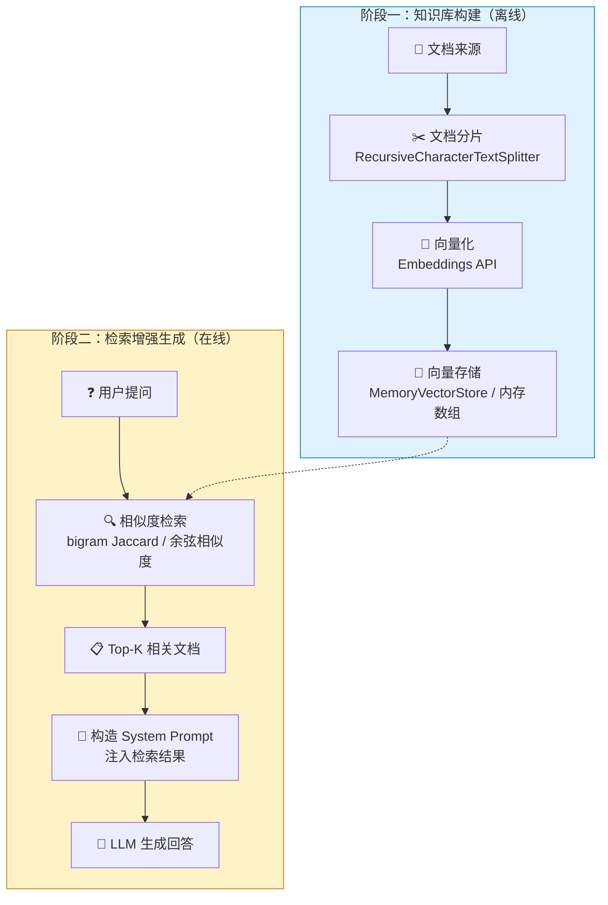

# LangChain.js RAG 检索增强生成详解

> **版本**: LangChain.js v0.3+ | **难度**: 中级 | **前置**: [LangChain.js前端学习路径](./LangChain.js前端学习路径.md)
>
> 本文档深入讲解 RAG（Retrieval-Augmented Generation，检索增强生成）的核心原理、LangChain.js 中的实现方式，以及在本项目 [`LangChainStage7RAG.vue`](../pages/langchain/LangChainStage7RAG.vue) 中的完整实践。

---

## 目录

1. [什么是 RAG？](#1-什么是-rag)
2. [RAG 整体架构](#2-rag-整体架构)
3. [文档加载（Document Loading）](#3-文档加载document-loading)
4. [文档分片（Text Splitting）](#4-文档分片text-splitting)
5. [向量化与向量存储（Embeddings & Vector Store）](#5-向量化与向量存储embeddings--vector-store)
6. [相似度检索（Similarity Search）](#6-相似度检索similarity-search)
7. [Prompt 注入与 LLM 调用](#7-prompt-注入与-llm-调用)
8. [本项目完整实现](#8-本项目完整实现)
9. [纯前端 vs 后端 RAG](#9-纯前端-vs-后端-rag)
10. [最佳实践与常见问题](#10-最佳实践与常见问题)

---

## 1. 什么是 RAG？

### 1.1 核心问题

LLM 存在两个根本性局限：

| 问题 | 描述 | 示例 |
|------|------|------|
| **知识截止** | 训练数据有截止日期，无法获取最新信息 | "2026年最新政策是什么？" |
| **幻觉（Hallucination）** | 对不知道的内容会"编造"答案 | 问内部文档内容，LLM 凭空生成 |

### 1.2 RAG 的解决方案

RAG 的核心思想：**在提问之前，先从外部知识库中检索相关信息，将其作为上下文注入 Prompt，让 LLM 基于真实数据回答。**

```
传统 LLM 问答：
  用户提问 → LLM → 回答（可能幻觉）

RAG 问答：
  用户提问 → 检索知识库 → 找到相关文档 → 注入 Prompt → LLM → 基于文档回答
```

### 1.3 RAG 的七大步骤

```
┌──────────┐    ┌──────────┐    ┌──────────┐    ┌──────────┐
│ 1.文档加载 │ → │ 2.文档分片 │ → │ 3.向量化  │ → │ 4.向量存储 │
└──────────┘    └──────────┘    └──────────┘    └──────────┘
                                                     │
                                              ┌──────┴──────┐
                                              │  知识库就绪  │
                                              └──────┬──────┘
                                                     │
┌──────────┐    ┌──────────┐    ┌──────────┐    ┌──────┴──────┐
│ 7.LLM回答 │ ← │ 6.注入Prompt│ ← │ 5.相似度检索│ ← │  用户提问   │
└──────────┘    └──────────┘    └──────────┘    └─────────────┘
```

---

## 2. RAG 整体架构

### 2.1 架构全景图



### 2.2 数据流全景

```
┌─────────────────────────────────────────────────────────────────────┐
│                         RAG 数据流全景                               │
├─────────────────────────────────────────────────────────────────────┤
│                                                                     │
│  【知识库构建阶段】                                                   │
│                                                                     │
│  内置文档 ─┐                                                        │
│            ├──→ RecursiveCharacterTextSplitter ──→ Chunk[] ──→ 内存数组 │
│  上传文件 ─┘   chunkSize=100, overlap=20         [chunk1, chunk2, ...] │
│                                                                     │
│  【检索增强生成阶段】                                                  │
│                                                                     │
│  用户输入 ──→ simpleSimilarity(query, chunk) ──→ Top-3 相关文档       │
│              ├─ bigram Jaccard 相似度                                │
│              ├─ 短查询加权（≤6 bigrams）                              │
│              └─ 子串包含加分（+0.3）                                  │
│                                                                     │
│  Top-3 文档 ──→ System Prompt 模板 ──→ ChatOpenAI.invoke() ──→ 回答  │
│                                                                     │
└─────────────────────────────────────────────────────────────────────┘
```

---

## 3. 文档加载（Document Loading）

### 3.1 LangChain 官方 Document Loaders

LangChain 提供了丰富的文档加载器，支持多种格式：

| Loader | 格式 | 导入路径 |
|--------|------|----------|
| `TextLoader` | `.txt` | `@langchain/community/document_loaders/fs/text` |
| `CSVLoader` | `.csv` | `@langchain/community/document_loaders/fs/csv` |
| `PDFLoader` | `.pdf` | `@langchain/community/document_loaders/fs/pdf` |
| `JSONLoader` | `.json` | `@langchain/community/document_loaders/fs/json` |
| `DirectoryLoader` | 目录批量 | `@langchain/community/document_loaders/fs/directory` |
| `CheerioWebBaseLoader` | 网页 | `@langchain/community/document_loaders/web/cheerio` |
| `GithubRepoLoader` | GitHub 仓库 | `@langchain/community/document_loaders/web/github` |

### 3.2 关键限制：纯前端不可用

**所有 LangChain Document Loaders 都依赖 Node.js `fs` 模块**，无法在浏览器环境中运行。

```js
// ❌ 这在浏览器中会报错
import { TextLoader } from '@langchain/community/document_loaders/fs/text'
const loader = new TextLoader('./docs/readme.md')
// Error: Module "fs" has been externalized for browser compatibility
```

### 3.3 纯前端替代方案

本项目采用两种方式加载文档：

#### 方案 A：内置知识库（硬编码）

```js
// LangChainStage7RAG.vue - getKnowledgeDocuments()
getKnowledgeDocuments() {
  return [
    {
      title: 'LangChain 概述',
      content: `LangChain 是一个用于构建 LLM 驱动应用的框架...`,
    },
    {
      title: 'RAG 架构',
      content: `RAG（Retrieval-Augmented Generation）检索增强生成...`,
    },
    // ... 更多文档
  ]
}
```

**适用场景**：演示、学习、固定的参考文档。

#### 方案 B：文件上传（FileReader API）

```js
// LangChainStage7RAG.vue - handleFileUpload()
async handleFileUpload(event) {
  const file = event.target.files[0]

  // 使用浏览器原生 FileReader API 读取文件
  const content = await new Promise((resolve, reject) => {
    const reader = new FileReader()
    reader.onload = (e) => resolve(e.target.result)
    reader.onerror = () => reject(new Error('文件读取失败'))
    reader.readAsText(file, 'UTF-8')
  })

  // 然后进行分片...
}
```

**适用场景**：用户上传自己的 `.txt` / `.md` 文件作为知识库。

#### 方案 C：fetch 远程加载（可选扩展）

```js
// 从远程 URL 加载文档
const response = await fetch('/api/documents/readme.md')
const content = await response.text()
```

#### 方案 D：raw-loader 静态导入（可选扩展）

```js
// webpack 配置 raw-loader 后可直接导入文件内容
import docContent from '@/assets/docs/readme.md?raw'
```

### 3.4 方案对比

| 方案 | 环境 | 动态性 | 适用场景 |
|------|------|--------|----------|
| LangChain Loaders | Node.js 后端 | 高 | 生产环境 |
| 内置硬编码 | 纯前端 | 无 | 演示/学习 |
| FileReader 上传 | 纯前端 | 高 | 用户自定义知识库 |
| fetch 远程 | 纯前端 | 中 | 从 API 获取文档 |
| raw-loader 导入 | 纯前端（构建时） | 低 | 静态文档打包 |

---

## 4. 文档分片（Text Splitting）

### 4.1 为什么需要分片？

1. **LLM 上下文窗口有限**：即使是最新模型也有 token 上限，不能一次塞入整本书
2. **检索精度**：太长的文档片段会稀释语义，降低检索相关性
3. **成本控制**：更少的 token 意味着更低的 API 调用成本

### 4.2 RecursiveCharacterTextSplitter 详解

[`RecursiveCharacterTextSplitter`](node_modules/@langchain/textsplitters/dist/index.d.ts) 是 LangChain 推荐的分片器，也是本项目使用的核心组件。

#### 导入路径

```js
import { RecursiveCharacterTextSplitter } from '@langchain/textsplitters'
```

#### 核心参数

| 参数 | 类型 | 默认值 | 说明 |
|------|------|--------|------|
| `chunkSize` | `number` | 1000 | 每个分片的最大字符数 |
| `chunkOverlap` | `number` | 200 | 相邻分片之间的重叠字符数 |
| `separators` | `string[]` | `["\n\n", "\n", " ", ""]` | 分隔符优先级列表 |
| `keepSeparator` | `boolean` | `false` | 是否在分片中保留分隔符 |

#### 递归分割原理

`RecursiveCharacterTextSplitter` 的核心思想是**按优先级递归分割**：

```
原始文本（超长）
    │
    ├── 尝试用 "\n\n"（段落）分割
    │   ├── 如果分片仍超长 → 尝试用 "\n"（行）分割
    │   │   ├── 如果分片仍超长 → 尝试用 " "（词）分割
    │   │   │   ├── 如果分片仍超长 → 尝试用 ""（字符）分割
    │   │   │   └── 分片 OK
    │   │   └── 分片 OK
    │   └── 分片 OK
    └── 分片 OK
```

这种递归策略确保：
- **优先保持语义完整性**：尽量在段落/句子边界分割
- **兜底保证不超限**：最终可以在字符级别强制分割

#### 本项目配置

```js
// LangChainStage7RAG.vue - initKnowledge()
const splitter = new RecursiveCharacterTextSplitter({
  chunkSize: 100,    // 每个片段最大 100 字符（演示用较小值）
  chunkOverlap: 20   // 片段之间重叠 20 字符
})

const chunks = await splitter.splitText(doc.content)
```

#### chunkOverlap 的作用

```
文档内容: "ABCDEFGHIJKLMNOPQRSTUVWXYZ"
chunkSize=10, chunkOverlap=3

分片结果:
  Chunk 1: "ABCDEFGHIJ"  (位置 0-9)
  Chunk 2: "HIJKLMNOPQ"  (位置 7-16，与 Chunk1 重叠 "HIJ")
  Chunk 3: "OPQRSTUVWX"  (位置 14-23，与 Chunk2 重叠 "OPQ")
  Chunk 4: "VWXYZ"       (位置 21-25)
```

**为什么需要重叠？**
- 避免关键信息恰好落在分片边界上被截断
- 提高检索召回率：即使查询跨越两个分片边界，也能在重叠区域命中

### 4.3 其他分片器

| 分片器 | 特点 | 适用场景 |
|--------|------|----------|
| `CharacterTextSplitter` | 按单个字符分割 | 简单场景 |
| `RecursiveCharacterTextSplitter` | 递归多级分割 | **通用推荐** |
| `TokenTextSplitter` | 按 token 数分割 | 需要精确控制 token 用量 |
| `MarkdownTextSplitter` | 按 Markdown 标题层级分割 | Markdown 文档 |
| `HTMLTextSplitter` | 按 HTML 标签分割 | 网页内容 |
| `CodeTextSplitter` | 按代码块分割 | 代码库索引 |

### 4.4 分片策略选择指南

```
┌──────────────────────────────────────────────────────┐
│                  分片策略决策树                        │
├──────────────────────────────────────────────────────┤
│                                                      │
│  你的文档类型是？                                     │
│  ├── 通用文本 → RecursiveCharacterTextSplitter       │
│  ├── Markdown → MarkdownTextSplitter                 │
│  ├── 代码     → CodeTextSplitter（按语言）            │
│  ├── HTML     → HTMLTextSplitter                     │
│  └── 需要精确 token 控制 → TokenTextSplitter          │
│                                                      │
│  chunkSize 设置建议：                                 │
│  ├── 演示/学习：100-200                               │
│  ├── 问答系统：500-1000                               │
│  ├── 文档摘要：1000-2000                              │
│  └── 代码搜索：500-1500（按函数粒度）                  │
│                                                      │
│  chunkOverlap 设置建议：                              │
│  ├── 通用：chunkSize 的 10%-20%                       │
│  ├── 问答系统：可适当增大（20%-30%）                   │
│  └── 代码搜索：可适当减小（5%-10%）                    │
│                                                      │
└──────────────────────────────────────────────────────┘
```

---

## 5. 向量化与向量存储（Embeddings & Vector Store）

### 5.1 什么是向量化？

向量化（Embedding）是将文本转换为高维数值向量的过程。语义相近的文本，其向量在空间中距离更近。

```
"猫是一种动物" → [0.12, -0.34, 0.78, ..., 0.05]  (1536维)
"狗是一种动物" → [0.11, -0.32, 0.75, ..., 0.04]  ← 向量相近
"今天天气很好" → [-0.45, 0.67, -0.23, ..., 0.89] ← 向量远离
```

### 5.2 LangChain Embeddings 集成

```js
// 标准用法（需要后端或 API Key）
import { OpenAIEmbeddings } from '@langchain/openai'

const embeddings = new OpenAIEmbeddings({
  model: 'text-embedding-3-small',
  apiKey: 'sk-...'
})

// 将文本转为向量
const vector = await embeddings.embedQuery('LangChain 是什么？')
// vector: Float32Array(1536)
```

### 5.3 本项目的简化方案

由于本项目使用内网模型，其 Embedding API 可能与 OpenAI 不兼容，因此采用**模拟向量存储**方案：

```js
// LangChainStage7RAG.vue - data()
data() {
  return {
    // 向量存储（简化版：用内存数组模拟）
    // 实际项目：用 OpenAIEmbeddings 将文本转为向量，存入 MemoryVectorStore
    vectorStore: [],
  }
}
```

**简化方案的本质**：跳过向量化步骤，直接存储原始文本，检索时用字符串相似度算法（bigram Jaccard）替代向量余弦相似度。

### 5.4 MemoryVectorStore 标准用法

```js
import { MemoryVectorStore } from '@langchain/classic/vectorstores/memory'
import { OpenAIEmbeddings } from '@langchain/openai'

// 1. 创建 Embeddings 实例
const embeddings = new OpenAIEmbeddings({
  model: 'text-embedding-3-small',
})

// 2. 从文档创建向量存储
const vectorStore = await MemoryVectorStore.fromDocuments(
  documents,    // Document[] 数组
  embeddings    // Embeddings 实例
)

// 3. 相似度搜索
const results = await vectorStore.similaritySearch('LangChain 是什么？', 3)
// results: Document[] 按相似度排序的 Top-3 文档
```

### 5.5 向量存储方案对比

| 方案 | 存储位置 | 持久化 | 适用场景 |
|------|----------|--------|----------|
| `MemoryVectorStore` | 内存 | ❌ 进程退出丢失 | 开发/演示 |
| `Chroma` | 本地/服务器 | ✅ | 中小规模生产 |
| `Pinecone` | 云服务 | ✅ | 大规模生产 |
| `Weaviate` | 自托管/云 | ✅ | 企业级 |
| `Qdrant` | 自托管/云 | ✅ | 高性能检索 |
| 本项目简化方案 | 内存数组 | ❌ | 学习/演示 |

---

## 6. 相似度检索（Similarity Search）

### 6.1 标准方案：余弦相似度

在真正的向量存储中，检索使用**余弦相似度**：

```
余弦相似度 = cos(θ) = (A · B) / (|A| × |B|)

取值范围：[-1, 1]
- 1：完全相同方向（最相似）
- 0：正交（无关）
- -1：完全相反方向
```

### 6.2 本项目方案：混合相似度算法

由于本项目使用模拟向量存储（原始文本），检索采用**混合相似度算法**，包含三个子策略：

```js
// LangChainStage7RAG.vue - simpleSimilarity()
simpleSimilarity(query, document) {
  const q = query.toLowerCase()
  const d = document.toLowerCase()

  // ==========================================
  // 策略1：子串包含检测（精确匹配加分）
  // ==========================================
  const containsBonus = d.includes(q) ? 0.3 : 0

  // ==========================================
  // 策略2：bigram Jaccard 相似度
  // ==========================================
  const toBigrams = (str) => {
    const bigrams = new Set()
    for (let i = 0; i < str.length - 1; i++) {
      bigrams.add(str.substring(i, i + 2))
    }
    return bigrams
  }

  const queryBigrams = toBigrams(q)
  const docBigrams = toBigrams(d)

  if (queryBigrams.size === 0) return containsBonus

  let intersection = 0
  for (const bg of queryBigrams) {
    if (docBigrams.has(bg)) intersection++
  }

  // ==========================================
  // 策略3：短查询加权
  // ==========================================
  let bigramScore
  if (queryBigrams.size <= 6) {
    // 短查询：命中率 = 交集 / 查询bigram数
    bigramScore = intersection / queryBigrams.size
  } else {
    // 长查询：标准 Jaccard = 交集 / 并集
    const union = queryBigrams.size + docBigrams.size - intersection
    bigramScore = union === 0 ? 0 : intersection / union
  }

  // 综合分数（上限 1.0）
  return Math.min(bigramScore + containsBonus, 1.0)
}
```

### 6.3 算法详解

#### Bigram（2-gram）

将文本拆分为连续两个字符组成的片段：

```
"RAG检索" → ["RA", "AG", "G检", "检索"]
"检索增强" → ["检索", "索增", "增强"]
```

交集：`{"检索"}` → 1 个匹配

#### Jaccard 相似度

```
Jaccard = |A ∩ B| / |A ∪ B|

示例：
  A = {"RA", "AG", "G检", "检索"}  (4个)
  B = {"检索", "索增", "增强"}      (3个)
  A ∩ B = {"检索"}                  (1个)
  A ∪ B = {"RA","AG","G检","检索","索增","增强"} (6个)

  Jaccard = 1/6 ≈ 0.167
```

#### 为什么 Bigram 对中文有效？

中文没有空格分隔词语，传统的 `split(/\s+/)` 分词方式失效：

```js
// ❌ 英文有效，中文无效
"负责检索增强生成".split(/\s+/)  // → ["负责检索增强生成"]（整个句子是一个词！）

// ✅ Bigram 对中英文都有效
toBigrams("负责检索增强生成")
// → {"负责","责检","检索","索增","增强","强生","生成"}
```

#### 短查询加权

标准 Jaccard 对短查询不公平：

```
查询: "5a8a4" → 4 个 bigrams
文档: 180 个 bigrams
Jaccard = 4 / (4 + 180 - 4) = 4/180 ≈ 0.022  ← 太低！

修复：当查询 bigrams ≤ 6 时，使用命中率
命中率 = 4/4 = 1.0  ← 合理！
```

### 6.4 检索流程

```js
// LangChainStage7RAG.vue - retrieveDocuments()
retrieveDocuments(query) {
  // 1. 计算每个文档片段与查询的相似度
  const scored = this.vectorStore.map((doc) => ({
    ...doc,
    score: this.simpleSimilarity(query, doc.content),
  }))

  // 2. 过滤零分文档，按相似度降序排序，取 Top-3
  const topDocs = scored
    .filter((d) => d.score > 0)
    .sort((a, b) => b.score - a.score)
    .slice(0, 3)

  return topDocs
}
```

### 6.5 检索策略对比

| 策略 | 中文支持 | 短查询 | 精确匹配 | 计算复杂度 |
|------|----------|--------|----------|------------|
| 词级 Jaccard（split） | ❌ | 一般 | 一般 | O(n) |
| Bigram Jaccard | ✅ | ❌（稀释） | 一般 | O(n) |
| Bigram 命中率 | ✅ | ✅ | 一般 | O(n) |
| 子串包含 | ✅ | ✅ | ✅ | O(n) |
| **本项目混合方案** | ✅ | ✅ | ✅ | O(n) |
| 余弦相似度（真向量） | ✅ | ✅ | ✅ | O(n·d) |

---

## 7. Prompt 注入与 LLM 调用

### 7.1 检索结果注入

检索完成后，将 Top-K 文档拼接为上下文，注入 System Prompt：

```js
// LangChainStage7RAG.vue - send()
// 1. 检索相关文档
const relevantDocs = this.retrieveDocuments(text)

// 2. 拼接为上下文
const context = relevantDocs
  .map((doc, i) => `[文档${i + 1}] ${doc.content}`)
  .join('\n\n')

// 3. 构造 System Prompt
const systemPrompt = `你是一个基于知识库回答问题的AI助手。
请严格根据以下提供的文档内容回答问题。

重要规则：
- 如果文档中包含用户查询的内容（即使是部分匹配、代码片段、哈希值等），
  你必须如实告知用户该内容在文档中存在，并引用相关文档片段
- 只有当文档中确实没有任何与用户查询相关的内容时，才说"知识库中没有相关信息"
- 不要因为文档内容看起来像随机字符串就忽略它

=== 知识库文档内容 ===
${context}
=== 文档内容结束 ===
请用中文回答，回答要准确、简洁。`
```

### 7.2 System Prompt 设计要点

| 要点 | 说明 | 本项目实践 |
|------|------|------------|
| **角色定义** | 明确 AI 的职责边界 | "基于知识库回答问题的AI助手" |
| **行为约束** | 限制回答范围 | "严格根据文档内容回答" |
| **边界处理** | 处理知识库无匹配的情况 | "文档中没有相关内容时才说不知道" |
| **特殊内容处理** | 避免忽略非自然语言内容 | "不要因为看起来像随机字符串就忽略" |
| **引用要求** | 提高可信度 | "引用相关文档片段" |

### 7.3 消息构造与 LLM 调用

```js
// 4. 构造消息（包含历史对话）
const historyMessages = this.messages
  .slice(0, -1)
  .map((msg) => {
    if (msg.role === 'user') return new HumanMessage(msg.content)
    if (msg.role === 'assistant') return new AIMessage(msg.content)
    return null
  })
  .filter(Boolean)

const langChainMessages = [
  new SystemMessage(systemPrompt),  // System Prompt（含检索结果）
  ...historyMessages                // 历史对话
]

// 5. 调用 LLM
const llm = new ChatOpenAI({
  model: 'EB-DeepSeek-V4-Pro',
  temperature: 0.3,  // 低温度，减少创造性，提高准确性
  // ...
})

const response = await llm.invoke(langChainMessages)
```

### 7.4 温度参数选择

| temperature | 行为 | RAG 适用性 |
|-------------|------|------------|
| 0.0 - 0.3 | 确定性输出，几乎相同输入得到相同输出 | ✅ **推荐**：基于文档回答需要准确性 |
| 0.5 - 0.7 | 平衡创造性和一致性 | 一般：创意性问答 |
| 0.8 - 1.0 | 高随机性，输出多样 | ❌：容易偏离文档内容 |

---

## 8. 本项目完整实现

### 8.1 文件结构

```
src/pages/langchain/LangChainStage7RAG.vue
├── <template>          # UI 层
│   ├── 知识库管理面板
│   │   ├── 状态栏（就绪/未初始化）
│   │   ├── 📦 内置知识库（初始化按钮）
│   │   ├── 📁 上传文件（FileReader）
│   │   └── 知识库内容预览（全部 chunks）
│   ├── 输入区域（textarea + 发送按钮）
│   ├── 检索结果面板（Top-3 文档 + 相关度）
│   └── 对话历史
│
├── <script>            # 逻辑层
│   ├── data()          # 状态管理
│   ├── getKnowledgeDocuments()  # 内置文档
│   ├── simpleSimilarity()       # 混合相似度算法
│   ├── initKnowledge()          # 初始化知识库
│   ├── handleFileUpload()       # 文件上传处理
│   ├── retrieveDocuments()      # 检索相关文档
│   └── send()                   # RAG 完整流程
│
└── <style scoped>      # 样式层
```

### 8.2 核心数据流

```
用户点击「初始化知识库」或「上传文件」
         │
         ▼
  getKnowledgeDocuments() / FileReader.readAsText()
         │
         ▼
  RecursiveCharacterTextSplitter.splitText()
  { chunkSize: 100, chunkOverlap: 20 }
         │
         ▼
  this.vectorStore = allChunks    ← 模拟向量存储
  this.knowledgeReady = true
         │
         │  ═══════ 知识库就绪 ═══════
         │
         ▼
  用户输入问题 → send()
         │
         ├──→ retrieveDocuments(query)
         │    ├── simpleSimilarity(query, chunk) × N
         │    ├── filter(score > 0)
         │    ├── sort(score desc)
         │    └── slice(0, 3) → Top-3 文档
         │
         ├──→ 构造 System Prompt（注入检索结果）
         │
         ├──→ ChatOpenAI.invoke([SystemMessage, ...historyMessages])
         │
         └──→ 显示回答 + 检索结果面板
```

### 8.3 关键设计决策

| 决策 | 选择 | 原因 |
|------|------|------|
| 向量存储 | 内存数组（模拟） | 内网 Embedding API 兼容性问题 |
| 相似度算法 | Bigram + 短查询加权 + 子串加分 | 中英文通用，无需分词库 |
| 文档来源 | 内置 + 上传 | 兼顾演示灵活性和用户自定义 |
| 分片大小 | chunkSize=100 | 演示用小值，便于观察分片效果 |
| 检索数量 | Top-3 | 平衡上下文长度和召回率 |
| LLM 温度 | 0.3 | 基于文档回答需要准确性 |

---

## 9. 纯前端 vs 后端 RAG

### 9.1 架构对比

```
┌─────────────────────────────────────────────────────────────┐
│                    纯前端 RAG（本项目）                       │
├─────────────────────────────────────────────────────────────┤
│                                                             │
│  浏览器                                                      │
│  ┌──────────────────────────────────────────────────────┐  │
│  │  FileReader API  ← 文件上传                           │  │
│  │  RecursiveCharacterTextSplitter ← 分片（前端库）      │  │
│  │  内存数组 ← 模拟向量存储                               │  │
│  │  Bigram Jaccard ← 相似度检索                          │  │
│  │  ChatOpenAI.invoke() ← LLM 调用（通过代理）           │  │
│  └──────────────────────────────────────────────────────┘  │
│                                                             │
│  优点：零后端依赖，快速原型                                   │
│  缺点：无真正向量检索，知识库不持久化，不支持大文件            │
└─────────────────────────────────────────────────────────────┘

┌─────────────────────────────────────────────────────────────┐
│                    后端 RAG（生产环境）                       │
├─────────────────────────────────────────────────────────────┤
│                                                             │
│  浏览器                        后端服务器                     │
│  ┌──────────┐    HTTP     ┌─────────────────────────────┐  │
│  │ 文件上传  │ ─────────→  │  TextLoader / PDFLoader     │  │
│  │ 用户提问  │ ─────────→  │  RecursiveCharacterTextSplitter│
│  │ 显示回答  │ ←─────────  │  OpenAIEmbeddings           │  │
│  └──────────┘             │  Pinecone / Chroma 向量数据库 │  │
│                           │  余弦相似度检索               │  │
│                           │  LLM 调用 + Prompt 注入       │  │
│                           └─────────────────────────────┘  │
│                                                             │
│  优点：真正向量检索，持久化，支持大文件，多用户                │
│  缺点：需要后端服务，部署复杂                                 │
└─────────────────────────────────────────────────────────────┘
```

### 9.2 何时升级到后端 RAG？

| 信号 | 说明 |
|------|------|
| 知识库超过 1000 个分片 | 内存数组检索性能下降 |
| 需要语义搜索 | Bigram 只能做字面匹配，无法理解同义词 |
| 需要持久化 | 刷新页面后知识库丢失 |
| 多用户共享知识库 | 需要中心化存储 |
| 支持 PDF/Word 等格式 | 需要后端文件解析能力 |

---

## 10. 最佳实践与常见问题

### 10.1 分片策略最佳实践

```
✅ 推荐：
  - 通用文本：chunkSize=500-1000, chunkOverlap=50-100
  - 根据文档类型选择分片器（Markdown/Code/HTML）
  - 保留元数据（来源、标题、页码）

❌ 避免：
  - chunkSize 过大（超过模型上下文窗口）
  - chunkOverlap=0（关键信息可能被截断）
  - 所有文档用同一个分片器（不同类型需要不同策略）
```

### 10.2 检索优化最佳实践

```
✅ 推荐：
  - 使用混合检索（向量 + 关键词）提高召回率
  - 设置相似度阈值过滤低质量结果
  - 对检索结果重排序（Re-ranking）
  - 短查询使用命中率而非 Jaccard

❌ 避免：
  - 只依赖单一相似度算法
  - 检索过多文档（增加 token 消耗和噪音）
  - 忽略检索结果为空的情况
```

### 10.3 Prompt 设计最佳实践

```
✅ 推荐：
  - 明确角色和职责边界
  - 要求引用来源（提高可信度）
  - 定义"不知道"的行为（避免幻觉）
  - 处理特殊内容类型（代码、哈希、数字）

❌ 避免：
  - Prompt 过于宽泛（LLM 可能忽略检索结果）
  - 不处理检索结果为空的情况
  - 温度设置过高（增加幻觉风险）
```

### 10.4 常见问题排查

| 问题 | 可能原因 | 解决方案 |
|------|----------|----------|
| 检索不到中文内容 | 分词方式不兼容中文 | 使用 Bigram 或接入中文分词库 |
| 短查询检索不到 | Jaccard 分母稀释 | 使用命中率替代 Jaccard |
| LLM 忽略检索结果 | System Prompt 约束不够 | 添加明确的行为规则 |
| 检索结果不相关 | 分片太大或太小 | 调整 chunkSize/chunkOverlap |
| 知识库初始化慢 | 文档太大或分片太多 | 异步处理 + 进度提示 |
| 上传文件解析失败 | 编码问题 | 指定 UTF-8 编码 |

### 10.5 进阶方向

```
当前实现                      进阶方向
─────────────────────────────────────────────────
Bigram 字面匹配      →    接入 Embeddings API 做语义检索
内存数组存储          →    Chroma / Pinecone 向量数据库
全量检索              →    索引优化（HNSW / IVF）
单一检索策略          →    混合检索 + Re-ranking
固定 Top-3            →    动态 Top-K（基于相似度阈值）
单轮检索              →    多轮检索（查询重写 / HyDE）
```

---

## 参考资料

- [LangChain.js 官方文档 - Retrieval](https://js.langchain.com/docs/concepts/retrieval/)
- [LangChain.js 官方文档 - Text Splitters](https://js.langchain.com/docs/concepts/text_splitters/)
- [LangChain.js 官方文档 - Vector Stores](https://js.langchain.com/docs/concepts/vectorstores/)
- [本项目 Stage7 实现](../pages/langchain/LangChainStage7RAG.vue)
- [LangChain.js 前端学习路径](./LangChain.js前端学习路径.md)
- [LangChain.js 深入学习路线](./LangChain.js深入学习路线.md)

---

> **文档版本**: v1.0 | **最后更新**: 2026-09-11 | **作者**: AI Agent 学习项目